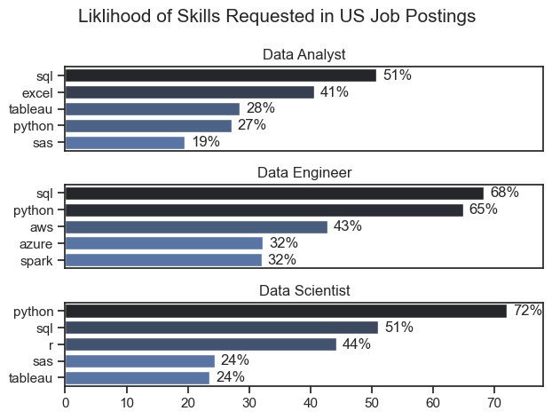

# Overview

Welcome to my analysis of the data job market, focusing on data analyst roles. This project was created out of a desire to analyze the job market more effectively. It analyzes job postings to discover the current highest paying, as well as most in-demand skills for Data analysts. 

The data sourced from Luke Barousse's Python Course which provides a foundation for my analysis, containing detailed information on job titles, salaries, locations, and essential skills. Through a series of Python scripts, I explore key questions such as the most demanded skills, skill trends, and the intersection of demand and salary in data analytics. 

# The Questions

Below are the questions I want to answer in my project: 
    1. What are the skills most in-demand for the top 3 most popular data roles?
    2. How are in-demand skills trending for Data Analysts?
    3. How well do jobs and skills pay for Data Analysts?
    4. What are the optimal skills for data analysts to learn? (High Demand AND High Paying)

# Tools I Used

To complete my analysis of the job market, I leveraged several key tools: 

* Python: The main tool I used in my analysis, enabling me to properly analyze the data and derive critical insights. I also utilized the following Python libraries:
    * Pandas Library: This was used to analyze the data.
    * Matplotlib Library: This was used to visualize the data.
    * Seaborn Library: This was used to create more advanced and more visually appealing visualizations.
* Jupyter Notebooks: The tool I used to run my Python scripts which let me easily include my notes and analysis.
* Visual Studio Code: My default code editor
* Git & GitHub: Essential for version control and sharing my Python code and analysis

# Data Cleaning and Preparation
This section shows the steps taken for ensuring the accuracy and usability of the data used. 

## Importation and Cleaning of Data

Importing the required libraries and loading the dataset I am analyzing. In addition, I also preformed some initial data cleaning tasks:

```python

# Importing Libraries
import pandas as pd
from datasets import load_dataset
import matplotlib.pyplot as plt  
import ast
import seaborn as sns

# Loading Data
dataset = load_dataset('lukebarousse/data_jobs')
df = dataset['train'].to_pandas()

# Data Cleanup
df['job_posted_date'] = pd.to_datetime(df['job_posted_date'])
df['job_skills'] = df['job_skills'].apply(lambda x: ast.literal_eval(x) if pd.notna(x) else x)

```

## Filtering for US Jobs

As I am located in the United States, I made my analysis focused specifically on US roles.

```python

df_us = df[df['job_country'] == 'United States']

```

# The Analysis

## 1. What are the most demanded skills for the top 3 most popular data roles?

To find the most demanded skills for the top 3 most popular data roles, I filtered out these positions by which ones were the most popular, and got the top 5 skills for these top 3 roles. This query highlights the most popular job titles and their top skills, showing which skills I should pay attention to depending on the role I'm targeting.

View my notebook with detailed steps here:
[2_Skill_Demand.ipynb](3_Python_Course_Project\2_Skill_Demand.ipynb)

### Visualize Data

```python
fig, ax = plt.subplots(len(job_titles), 1)

sns.set_theme(style='ticks')

for i, job_title in enumerate(job_titles):
    df_plot = df_skills_perc[df_skills_perc['job_title_short'] == job_title].head(5)
    sns.barplot(data=df_plot, x= 'skills_percent', y='job_skills', ax=ax[i], hue='skill_count', palette='dark:b_r')
    ax[i].set_title(job_title)
    ax[i].set_xlim(0, 78)
    ax[i].set_xlabel('')
    ax[i].set_ylabel('')
    ax[i].legend().set_visible(False)

    for n, v in enumerate(df_plot['skills_percent']):
        ax[i].text(v + 1, n, f'{v:.0f}%', va='center')
    if i != len(job_titles) - 1:
        ax[i].set_xticks([])
fig.suptitle('Liklihood of Skills Requested in US Job Postings', fontsize=15)
plt.tight_layout()
plt.show()
```

### Results



### Insights

- Python is a versatile skill, highly demanded across all three roles, but predominantly for data Scientists (72%) and Data Engineers (65%).
- SQL is the most requested skills for Data analysts and Data Scientists, with it in over half of the job postings for both roles. For Data Engineers, Python is the most sought-after skill, appearing in 68% of job postings.
- Data Engineers require more specialized technical skills (AWS, Azure, Spark) compared to Data Analysts and Data Scientists who are expected to be proficient in more general data management and analysis tools (Excel, Tableau).

## 2. How are in-demand skills trending for Data Analysts?

### Visulize Data

```python

df_plot = df_da_us_perc.iloc[:, :5]
sns.lineplot(df_plot, dashes=False, palette='tab10')

from matplotlib.ticker import PercentFormatter
ax.yaxis.set_major_formatter(PercentFormatter(decimals=0))

plt.show()

```

### Results


*Line graph visualizing the trending top skills for data analysts in the US in 2023.*

### Insights:
- SQL remained the most in-demand skill throughout 2023, with a slight decline towards the end of the year but still maintaining a lead over other skills.
- Excel showed a steady decline from mid-year but experienced a notable increase towards December, indicating a resurgence in demand.
- Tableau and Python displayed similar trends, both seeing a gradual decrease in demand during the second half of the year, with SAS maintaining the lowest demand of the top 5 throughout.

## 3.  How well do jobs and skills pay for Data Analysts?

### Salary Analysis

#### Visualize Data

```python
sns.boxplot(data=df_us_top6, x='salary_year_avg', y='job_title_short', order=job_order)
sns.set_theme(style='ticks')

ticks_x = plt.FuncFormatter(lambda y, pos: f'${int(y/1000)}K')
plt.gca().xaxis.set_major_formatter(ticks_x)
plt.show()

```

#### Results


*Box plot visualizing the salary distributions for the top 6 data jobs.*

#### Insights

- There is significant variation in the salary ranges across job titles. Senior Data Scientist tend to have the highest salary while Data analysts tend to have the lowest salary. this shows the high value placed on experience and skills in the industry.  
- Senior Data Scientists and Senior Data Engineers both show significant outliers that could point towards more advanced skills and abilities being rewarded with very high pay in those positions. In contrast, Data Analysts tend to have fewer outliers and a more consistent salary range. 
- Senior roles in general receive a higher salary, however, median Senior Data Analyst salary does rank below regular Data Science and Data Engineer postings. 

### Highest Payed & Most Demanded Skills for Data

#### Visualize Data

```python

fig, ax = plt.subplots(2, 1)

#Top 10 Highest Payed Skills for Data Analaysts
sns.barplot(data=df_da_top_pay, x='median', y=df_da_top_pay.index, ax=ax[0], hue='median', palette='dark:b_r')


#Top 10 Most In-Demand Skills for Data Analysts
sns.barplot(data=df_da_skills, x='median', y=df_da_skills.index, ax=ax[1], hue='median', palette='light:b')


plt.show()

```

#### Results

Here's the breakdown of the highest-payed skills and most in-demand skills for data analysts in the US:


*Two separate bar graphs visualizing the highest paid skills and most in-demand skills for data analysts in the US.*

#### Insights 

- The top graph shows that specialized skills like 'dplyr', 'Bitbucket', and 'Gitlab' can command the highest salaries with some at the $200k mark, suggesting technical proficiency can increase earning potential. 
- The bottom graph highlights that foundational skills like 'Excel', 'PowerPoint', and 'SQL' are the most in-demand , even though they may not offer the highest salaries. This demonstrates the importance of these core skills for employability in data analysis roles. 
- There's a clear difference between the highest paid and most in-demand skills. The highest paid skills are more specialized, but also have far less demand, with some even having only single digit job postings. However, their median earning potential is far greater than the most in demand job skills. This suggests analyst should aim to develop a wide range of skills with some being more in demand, and possibly some more niche and technical skills to maximize their earning potential. 

## 4. What is the most optimal skill to learn for Data Analysts?

#### Visualize Data

```python
from adjustText import adjust_text
import matplotlib.pyplot as plt

plt.scatterplot(df_da_skills_high_demand['skills_percent'], df_da_skills_high_demand['median_salary'])
plt.show()

```
#### Results


*A Scatter plot visualizing the most optimal skills (high paying & high demand) for data analysts in the US.*

#### Insights:

- According to the scatter plot many of the 'programming' type skills (blue) are gathered towards the upper ranges of both the high demand and high paying sections of the plot. This indicates that these skills may reward higher salary benefits in the data analytics field. 

- Analyst tools (green), such as Tableau and Power BI, are very common in job posting and also command a higher salary, signifying that these are useful and versatile skills in the data analytics field. 

- The scatterplot indicates that database skills (orange), such as Oracle and SQL Server, can command some of the highest salaries in the field. This shows a high demand for database management and manipulation ability and expertise among data analysts. 

# What I Learned:

Through this project I both grew my understanding of the current data analyst market, and further developed my technical skills in Python, especially my ability to manipulate and visualize data. Here are some of the specific things I learned: 

* __Advanced Python Usage__: Utilizing libraries such as Pandas for manipulating data, Matplotlib and Seaborn for visualizing data, and other libraries assisted me with performing more complex data analysis tasks more effectively and efficiently
* __Data Cleaning Importance__: I reinforced my knowledge that thorough data cleaning and preperation are critical parts of any data analysis project, and are key for creating correct and actionable insights.
* __Strategic Skills Analysis__: This project showed the crucial nature of aligning one's skills and professional learning with the current market in addition to looking to what may be required in the market in the future. To more strategically plan for the future tech industry an understanding of the relationship between skill demand, salary, and job availability are necessary. 

# Insights

I found several insights concerning the US job market for Data Analysts:

* __Skill Demand and Salary Correlation__:The data from this project clearly indicate that there is a direct correlation between the demand for specific skills and the salary these skills command. Specialized as well as advanced skills such as Python and Oracle often lead to higher salaries.
* __Market Trends__: The market shows distinct trends in changes for demands for certain skills. This further emphasizes the need to stay aware of what skills are rising and falling in demand in the analyst job market.
* __Economic Value of Skills__: You can maximize your economic benefit as a data analyst by understanding what skills are both well-compensated and in-demand.

# Challenges I Faced 

This project had several challenges that were necessary to overcome and proivide good opportunities for learning:

* __Data Inconsistencies__: Handling missing and inconsistent data in the data set requires attention to detail, thorough consideration of how the changes may affect the dataset, and using correct data cleaning techniques in order to properly ensure data integrity.
* __Complex Data Visualization__: I was challenged in this project to create adequate and effective visualizations of the data to clearly and compellingly convey insights which provided a great learning opportunity. 
* __Balancing Breadth and Depth__: Keeping the right sense of scale with the data required a balancing act of diving deep enough into the data to obtain proper insights while not so deep as to get lost in the details.  

# Conclusion

This project has been highly informative in my pursuit of continuing my education as a data analyst. It has shed light on essential skills and trends that define this dynamic field. The insights I have gained have not only strengthened my understanding of the field, but also offered practical guidance for anyone aiming to progress in data analytics. As the market continually evolves, ongoing analysis will be vital to stay competitive. This project serves as a strong foundation for future explorations and emphasizes the importance of continuous learning and adaptability in the data industry.